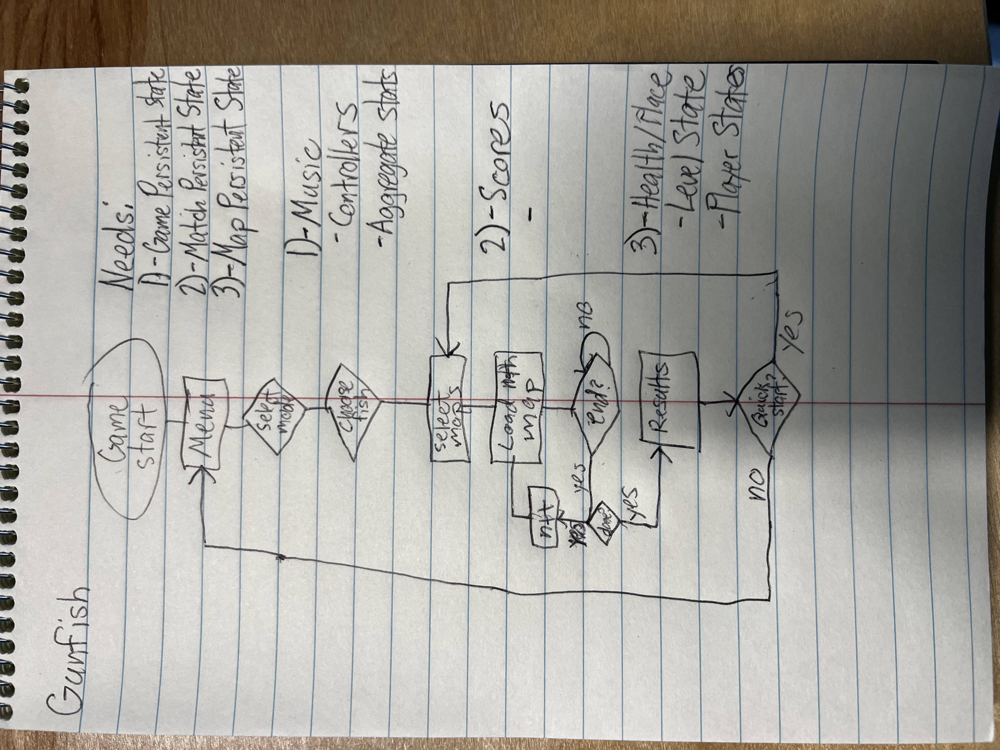

# Gunfish

## Creating a new build

### Scene and Build Settings

When you add new scenes to a LevelList ScriptableObject, it should automatically update the build settings to include it. However, to double check go to `File->Build Settings...` or press `Ctrl+Shift+B` to confirm. Most of the build details are already done, but in case you want to change things you can modify them in `Player Settings...` in the Build Settings window. Our Gunfish Rectangle is windows, so make sure you're building on Windows.

### Building

Once you're ready to build, in the Build Settings hit `Build` or `Build and Run`. The first time you do this, it will ask you for a folder to build to. You can select anywhere but keep in mind that the folder you select will be the root, so if you're doing multiple builds make sure it's in a subfolder. I recommend putting it in the Unity Project root (`Gunfish/Gunfish`) under a newly created `Build` folder, which is already set up to be ignored in Git.

### Packaging

Once the build is done and you've verified it works on your own machine, right click and compress to a Zip. Then, [create a new Git release](https://github.com/ryanakann/Gunfish/releases/new). For `Choose a tag`, increment the version number (i.e. for v0.1.0-beta change it to v0.1.1-beta). For viable MAGFest builds, start labeling them as `v1.x.x` and no beta. Target should be `main` if it's up to date, otherwise `develop`. Release title can just be `Gunfish`, and you can choose whatever you want for the description. I recommend `Generate release notes` which makes a description automatically, and it's honestly not bad. In the `Attach binaries by dropping them here or selecting them.` section, drag and drop the Zip from File Explorer. Now, you can Publish release.

### Release

On the Gunfish Rectangle, navigate to the [Gunfish tags](https://github.com/ryanakann/Gunfish/tags). Permissions should already be set up to Ryan Kann, but in case they aren't log into your own GitHub and you should have permission. Click on the release you just made, go down to `Assets`, and download the binary Zip for the Windows build. You can add it anywhere, though I recommend the Desktop so its easy to find if needed by MAGFest staff. Finally, right click and unzip it. The executable will be inside this folder.

### Autoplay on Startup

Here are detailed instructions from Microsoft to [Add an app to run automatically at startup](https://support.microsoft.com/en-us/windows/add-an-app-to-run-automatically-at-startup-in-windows-10-150da165-dcd9-7230-517b-cf3c295d89dd). To summarize, `Windows logo key + R`, type `shell:startup` and press enter. Then, add a shortcut to the Gunfish .exe file in the build folder.
