# GunFish Stats!
Data analysis for GunFish in MAGFest's Indie Arcade 2025.

## Basics
Sanity check fundamentals, like whether one player-controller wins more than others.
Display baseline stats like play count, number of non-scoring players, etc.

Initial takeaway is that somewhat less than a third of players get **no kills at all**.  
Likewise, no player in the entire convention managed to stock-out all of their foes in a 4-player game single-handedly,
and only **once** did a player manage to single-handedly stock-out both opponents in a 3-player match.  

<table border="1" class="dataframe">
  <thead>
    <tr style="text-align: right;">
      <th></th>
      <th>Total Games</th>
      <th>Total Points</th>
      <th>Total Players</th>
      <th>Non-Scorers</th>
      <th>Scoring Percent</th>
      <th>Highest Score</th>
      <th>Many-Player Stock-Outs</th>
    </tr>
  </thead>
  <tbody>
    <tr>
      <th>0</th>
      <td>1210</td>
      <td>4016.0</td>
      <td>2990</td>
      <td>935</td>
      <td>69%</td>
      <td>7.0</td>
      <td>1</td>
    </tr>
  </tbody>
</table>

The game where a player managed to take all the stocks of both opponents was a Pufferfish dominating two Eels on the Beach.  
The Pufferfish rated the game positively, and the others did not rate. It is altogether possible this was one person at
the cabinet playing solo - something I saw a handful of times.  

<table border="1" class="dataframe">
  <thead>
    <tr style="text-align: right;">
      <th></th>
      <th>P1 Fish</th>
      <th>P1 Score</th>
      <th>P1 Rating</th>
      <th>P2 Fish</th>
      <th>P2 Score</th>
      <th>P2 Rating</th>
      <th>P3 Fish</th>
      <th>P3 Score</th>
      <th>P3 Rating</th>
      <th>P4 Fish</th>
      <th>P4 Score</th>
      <th>P4 Rating</th>
      <th>Map</th>
      <th>Avg Rating</th>
      <th>Player Count</th>
      <th>Avg Score</th>
      <th>max_score</th>
      <th>full_stock</th>
    </tr>
  </thead>
  <tbody>
    <tr>
      <th>31</th>
      <td>Pufferfish</td>
      <td>6.0</td>
      <td>0.0</td>
      <td>Eel</td>
      <td>2.0</td>
      <td>1.0</td>
      <td>NaN</td>
      <td>NaN</td>
      <td>0.0</td>
      <td>Eel</td>
      <td>0.0</td>
      <td>0.0</td>
      <td>beach</td>
      <td>0.25</td>
      <td>3</td>
      <td>2.67</td>
      <td>6.0</td>
      <td>True</td>
    </tr>
  </tbody>
</table>

There is a slight trend towards P2 victories. Might not be significant?

    <Axes: title={'center': 'Player Wins per Play'}, ylabel='wnorm'>

    
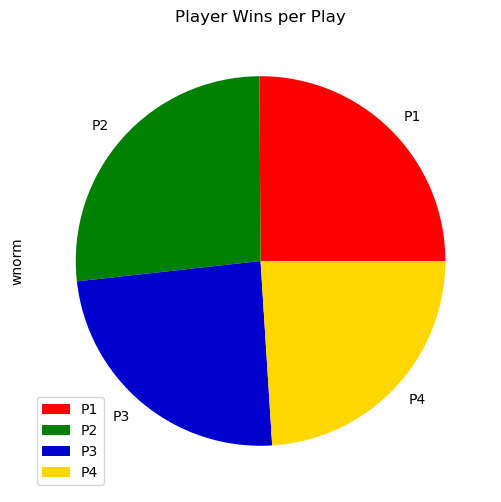
    

1-v-1 matches make up **more than 50%** of all matches! This gameplay should get extra attention in map deisgn and playtesting.  

    <Axes: title={'center': 'Player Counts'}, ylabel='count'>

    
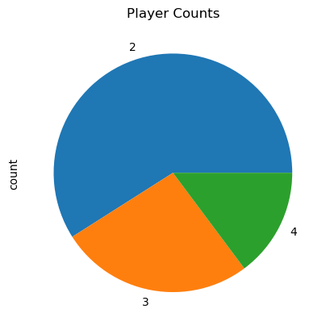
    

## Fish Stats
Stat breakdowns by Fish. Popularity, average score, etc.

### Fish Popularity
The **Bassic Fish** is the most frequently-chosen. This is expected, as it is the default.  
Flyfish, Salmon, and Pufferfish are the next three fish to the right of the Bassic,
which may explain their prevalence.  
Anglerfish has a clear, appealing concept from the art, while Needlefish is rendered somewhat small,
potentially explaining their positions.  

    <Axes: title={'center': 'Fish Popularity'}, xlabel='Fish'>

    
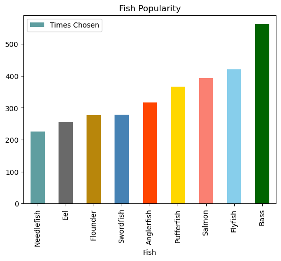
    

### Homogeneous Matches
By far, most games that were played with all the same fish were played with the **Bassic Fish**.  
This is, again, not unexpected as the Bassic Fish is the default.  
Swordfish appearing relatively often in homogeneous matches is perhaps interesting -
likely due to its power and control. Do we feel that the Swordfish should be made less
appealing in our game about being fishes with guns in their mouths?  
Perhaps more interesting is the Flyfish being second-most-homogeneous, despite being, statistically, "mid".
Perhaps there are players recalling its dominance from last year?  

    <Axes: title={'center': 'Matches with All the Same Fish'}, xlabel='Fish'>

    
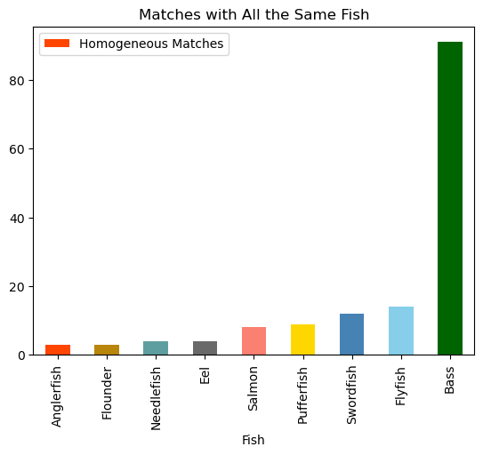
    

### Average Score per Play
This examines average score per fish per *play* -
this means that if a match is played between 4 Bass, that is 4 plays for the Bass.

Salmon, Swordfish, and Pufferfish having the highest average score is not unexpected.
They are powerful fish with either high damage potential or a great deal of control.  

Worthy of note is the Anglerfish and Bass averaging **less than 1 point per appearance**.
Ideally, we should produce few matches where players do not manage a single point.  

    <Axes: title={'center': 'Average Score per Play'}, xlabel='Fish'>

    
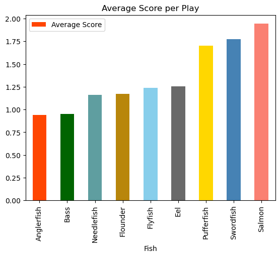
    

### Non-Scoring Plays
Given that there are fish averaging less than 1 point per play, how many total non-scoring
play-sessions did each fish have?  

Before we begin, there is a major confounding factor in this data that should give us pause -
sometimes players were seen to start matches with multiple fish and only one player, as they
proceeded to practice picking off the AFK fish. These sessions would produce non-scoring plays
for the fish chosen, and may contribute to the Bassic Fish's second-place status here, it being
the default fish.  

That said, the Anglerfish fails to score nearly *half* of the time, demonstrating that it needs
adjustment either in its damage output or in its controllability. Likewise the Eel seems to
suffer - likely with damage output in maps where there is insufficient water to use its mechanical
bonuses. These results seem reliable, as the fish in question are not the default Bassic fish,
and likely represent genuine play-sessions.  

The Bassic Fish also running about a 40% non-scoring rate seems undesirable. Sure, new players
may require a play session or two in order to become familiar with the controls, but making it
easier to score would likely increase the likelihood of their putting in that session-or-two.
Lacking data from which to estimate how many players put in a single session and then walked
away, however, leaves us only with a hunch in this respect. It is possible that most players
put in the session-or-two necessary to figuring out the controls regardless of whether they
have a non-scoring first session.  

    <Axes: title={'center': 'Non-Scoring Plays per Play per Fish'}, xlabel='Fish'>

    
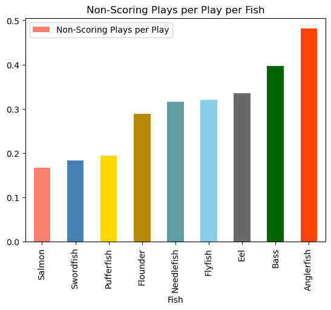
    

### Fish Wins per Appearance
This counts times when a fish got a non-tying high score divided by matches
where *any* player chose that fish.

These results are very similar to the Average Score per Play results,
except that the Bass performs better while the Eel and Flounder drop. This makes
sense, as the many all-Bass games guarantee Bass wins whenever they occur. The
Salmon's dominant performance, winning nearly *half* of all matches where a
Salmon is chosen, with very few Salmon-only matches, demonstrates strongly that
"GunFish devs pls nerf Salmon" is a respectable and correct sentiment.  

    <Axes: title={'center': 'Fish Wins per Appearance'}, xlabel='Fish'>

    

    

### Fish Win Rate in 1-v-1s
The 1-v-1 Win Rate for fish is very similar to the win rate in non-1-v-1s.

    <Axes: title={'center': 'Fish Win Rate in 1-v-1s'}, xlabel='Fish'>

    
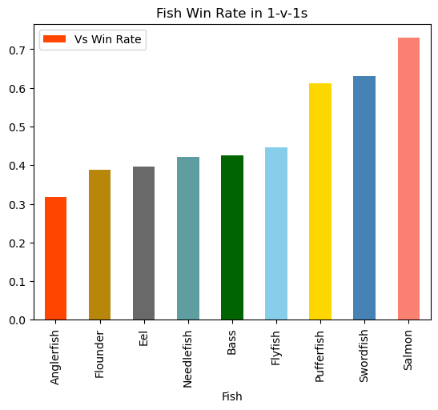
    

### Negative Ratings per Fish Appearance
Setting aside that the data set is too small to reach any solid conclusions, this is what we can find from negative ratings.  

The Bass and Eel appearing near the top of this chart is unsurprising, as Bass is likely to be played by
a new player who has not (or will not) figure out the controls. The Eel simply does not do very well in
most games. The Pufferfish being third is more surprising, as it typically performs quite well in terms of
victory and scoring metrics. This perhaps is due to the Pufferfish's control scheme being one of the less
intuitive of the "special fish" (two button-presses in order to detonate the grenade early). A player might also
perform well as the Pufferfish, but recognize that this performance is "bullshit" and due to an unbalanced
situation.  

The Swordfish producing the fewest negative reviews is likely due to it being the easiest fish to control, and
it performing well mechanically. This again raises the question of whether we want the Fish without a Gun to be
so good and fun in GunFish. Naturally, making the game less fun overall by removing the Swordfish seems like the
wrong response, so perhaps the correct line of action is *not* to nerf the Salmon or Swordfish, but rather to
*buff* all other fish? Naturally, the actual balance implications of doing so are difficult to predict, but if
players are having fun doing a lot of damage or having high control, maybe we should find ways to bring that
gameplay to more fish.  

    <Axes: title={'center': 'Negative Ratings per Fish Appearance'}, xlabel='Fish'>

    
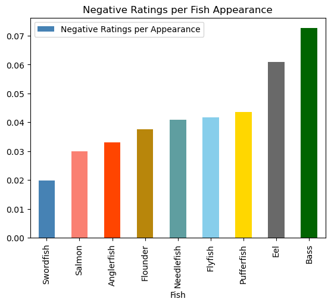
    

Correlation between fish Rating and Score. There does not appear to be a strong link between the two.

    0.06880304096281495

Likewise, there does not appear to be a strong link between Rating and victory in the match.

    0.026491324251284958

## Map Stats
Breakdowns of stats by Map to identify trends between fish performance and map nature. Infer connections to
number of map hazards, sight-lines, etc.  

### Average Score per Map
Barrel is the highest scoring map, which is not unexpected, as it places all the
fish within easy reach of one-another, without any map hazards.  
Likewise, Valley, Acid Factory, and Firing Range being lower-scoring is explicable
due to their broken-up sightlines, and deadly map hazards.  

    <Axes: title={'center': 'Average Score per Map'}, xlabel='Map'>

    
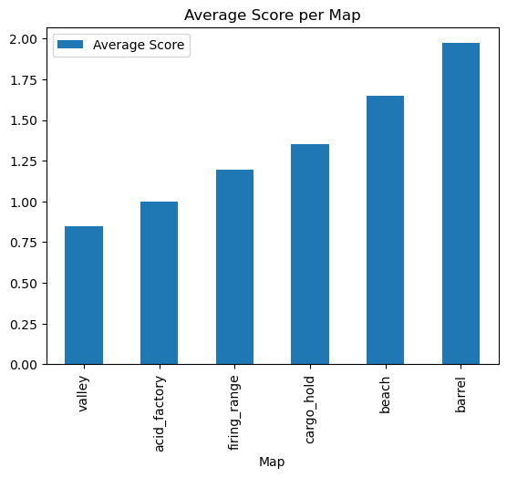
    

### Average Score per Fish per Map
How does this break out per Fish?

We can see a clear impact where the raycast fish like the Bass and Needlefish struggle
more on maps with more restricted sightlines, such as Cargo Hold, Valley, or Acid Factory.
In that vein, the Flounder appears to be underperforming on such maps, despite being another
raycast-centric fish, though it does have a fairly short range. Likely, it needs a small buff.  

Finally, if we want to allow the **Bassic Fish** to be more viable on most maps, we
should consider having maps be somewhat less tight, which may improve the game experience
for new players choosing the default fish. At the same time, maps with a lot going
on are chaotic and fun, at least in the opinion of this dev.  

    <seaborn.axisgrid.FacetGrid at 0x2648836c9e0>

    
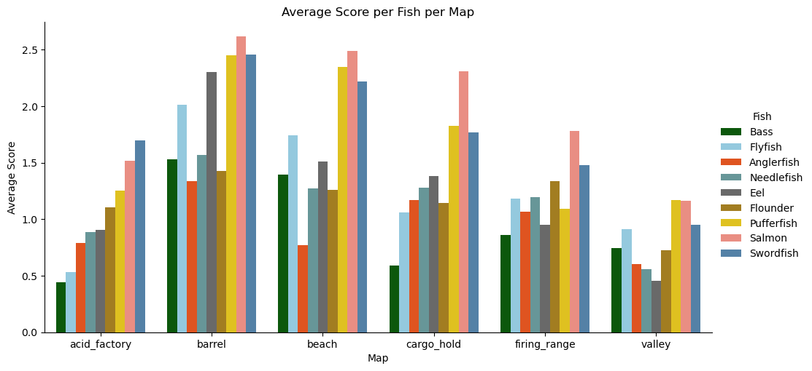
    

### Win Rate per Fish per Map

    <seaborn.axisgrid.FacetGrid at 0x2648e7f2ed0>

    
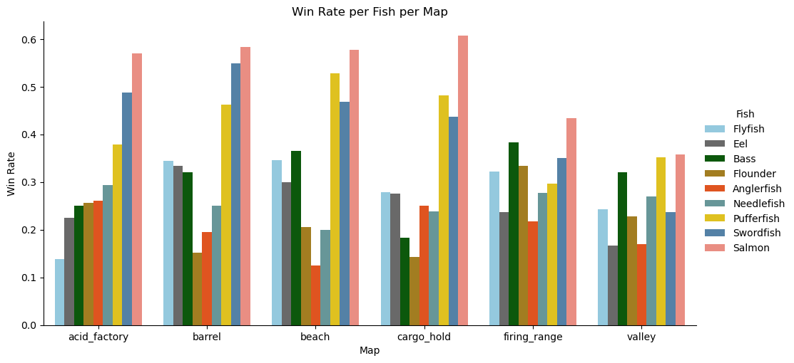
    

### Rating Rate
To test that hypothesis of "chaos -> fun", we look at the ratings players gave to matches on
given maps, broken out by fish. First, however, we must consider how many matches were actually rated.  

    'Out of 2990 plays, we received 977 non-zero Ratings, for a 33% rating - uh - rate.'

### Average Rating per Map
Given the caveat that only 1/3 players rated the game, we can start looking at the breakdown
by map, and then by fish and map.  

The first takeaway is that, even though Acid Factory is one of the lowest maps in terms of
average score, it nevertheless is rated highly. If we hazard to draw conclusions from this scant
data, we could say that Acid Factory is just plain-old fun. This, actually, reflects the devs'
sentiments from playtesting - Acid Factory was one of our favorites, too.  

Valley and Firing Range do not seem to make up for their low average scores with good ratings,
so likely they need some tuning in order to reach the heights of Acid Factory.  

    <Axes: xlabel='Map'>

    
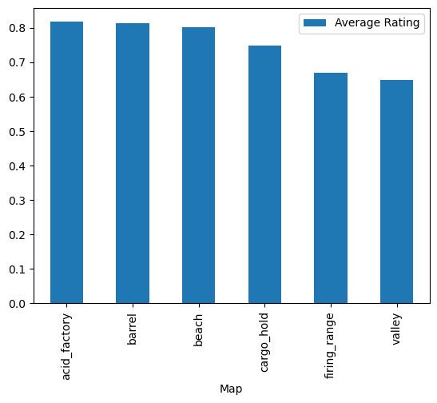
    

### Average Rating per Map per Fish
Breaking down rating by fish reveals that the Flounder and Needlefish rated some maps
highly despite their lackluster performance. They were both solidly middle-of-the-road
in terms of mechanical performance on Acid Factory, but gave it universally positive ratings.  

Likely, however, we should not draw too many conclusions from this data, given its sparse
nature.

    <seaborn.axisgrid.FacetGrid at 0x2648e160d40>

    
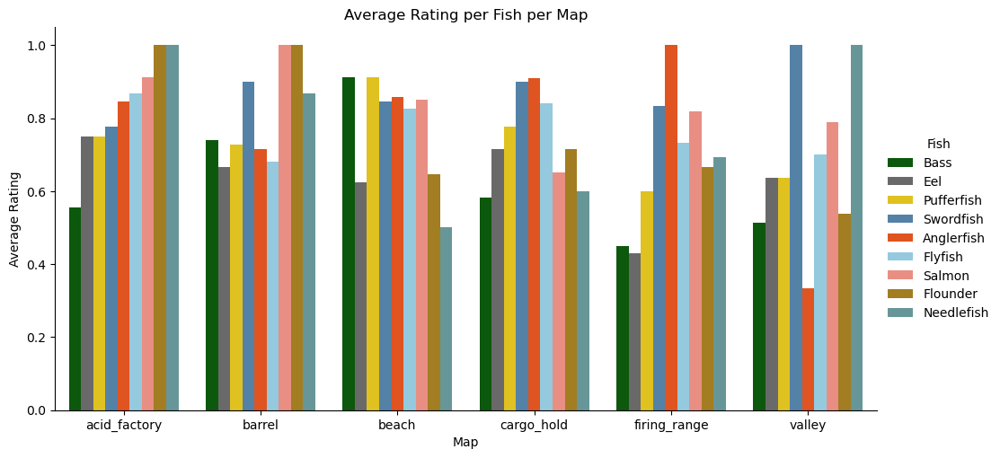
    

### Negative Rating Count per Fish per Map
Again, these counts are small enough that they *could* be due to simple
**gamer variation** - e.g. we saw some individuals playing many games in a row,
and rating negatively each time. Presumably these negative ratings were not
*quite* reflective of their true sentiment, but so it goes.  

If we attempt to look past that, however, we can see that the Bassic Fish was
likely handing out more negative ratings due to being the choice for new players,
though the maps with open sight-lines perform meaningfully better even in this case.  

    <seaborn.axisgrid.FacetGrid at 0x2648f61d8b0>

    
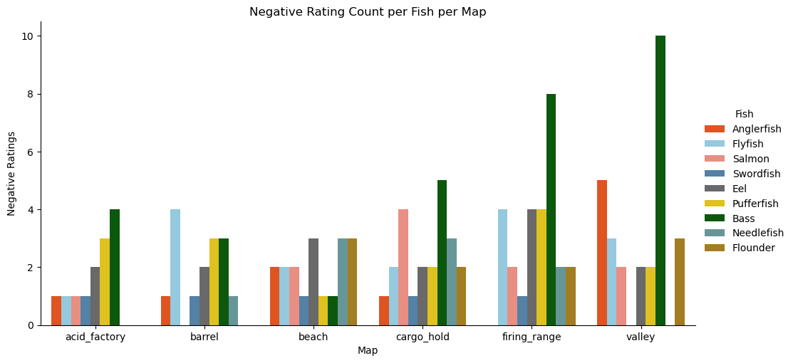
    

### Non-Scoring Rate per Fish per Map
Looking at the number of non-scoring plays per fish per map, we can see the results re-emphasized
that Acid Factory gets similar results in terms of low-scoring games, but nevertheless is fun
enough that players don't *seem* to disprefer it to other maps (at least not too strongly).

    <seaborn.axisgrid.FacetGrid at 0x2648ee08d40>

    

    

## 1-v-1 Stats

### Win Rate in 1-v-1s Between Fishes
From these matchups, it is clear that the Swordfish outperforms many other fish,
while the likes of the Flounder generally underperform. The Bass appears to perform relatively poorly in head-to-head matches, as well.  

    [Text(0.5, 1.0, 'Win Rate in 1-v-1s Between Fishes')]

    

    

### Average Winning Score Differential in 1-v-1s Between Fishes

    [Text(0.5, 1.0, 'Average Winning Score Differential in 1-v-1s Between Fishes')]

    

    

## Fish Similarity!
Metrical similarity between fishes, per the cosine similarity between fish in these metrics:

    ['acid_factory_win_rate',
     'barrel_win_rate',
     'beach_win_rate',
     'cargo_hold_win_rate',
     'firing_range_win_rate',
     'valley_win_rate',
     'acid_factory_non_scorers',
     'barrel_non_scorers',
     'beach_non_scorers',
     'cargo_hold_non_scorers',
     'firing_range_non_scorers',
     'valley_non_scorers',
     'anglerfish_sdiff',
     'bass_sdiff',
     'eel_sdiff',
     'flounder_sdiff',
     'flyfish_sdiff',
     'needlefish_sdiff',
     'pufferfish_sdiff',
     'salmon_sdiff',
     'swordfish_sdiff']

The high-similarity parings of the Bass with the Needlefish and the Eel with the Pufferfish make sense given that the former are our bog-standard raycast-em-once fish and the latter are our lob-a-GameObject-with-AOE-at-em fish. They'll be similarly advantaged or disadvantaged by similar map layouts, objects, lineups, etc.  

The Flyfish's relative dissimilarity from the Salmon, despite their both being "machine gun fishes", is likely due to the latter's
dominant performance thoroughly overshadowing the Flyfish's statistically "mid" performance.

    [Text(0.5, 1.0, 'Fish Cosine Similarity')]

    
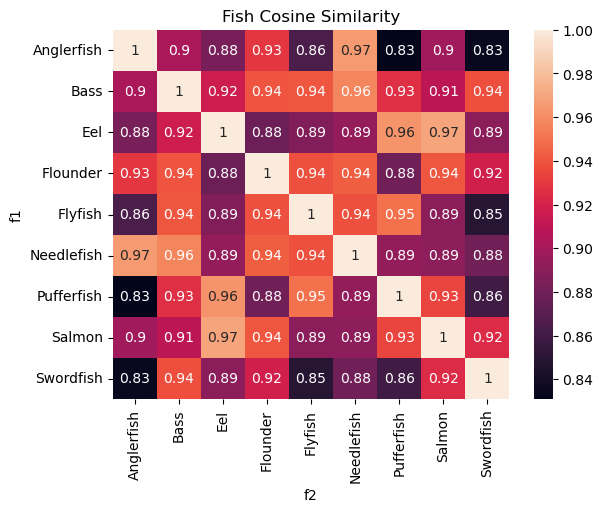
    

# Conclusions & Additional Thoughts
## Fish Balance
The clear and decisive outlier performance of the Salmon recommends adjustments to bring it closer to baseline.
The best way to do this, however, may be to improve the performance of the other fish, rather than to nerf the
Salmon. Conversely, the Pufferfish seems like it needs a reduction in performance, or at least an adjustment
that takes into account the fact that players seemed to rate it poorly, despite its good mechanical performance.  

Giving the Pufferfish a smaller radius for its AOE, but with less sharp damage dropoff, may be an appropriate
initial adjustment, but improving the other fish to come closer to the Salmon likely requires more fundamental
adjustments to how the game controls. Possibly, giving player more control over the rotation of their fish would
achieve this end, though the Salmon may also deserve a minor damage debuff in addition, especially if it is going
to benefit from increased accuracy granted by better fish control.  

Apart from the high-performing fish, the Flounder and Anglerfish could do with some help - likely a quicker buildup
of charge & damage for the Anglerfish, with either higher damage, or perhaps even a tighter spread on raycasts for
the Flounder. If a means of better fish control can be found, though, these fish may already find themselves to be
sufficiently adjusted. It also should be seen whether the Anglerfish might simply perform adequately in more-
experienced hands. Likely, a dev-only stats gathering session is in order, so that we can see what performance looks
like when fish are exclusively controlled by players who know the game mechanics well.  

Finally, maybe this is all wrong! Maybe we're drawing overly-strong conclusions from insufficient data! Maybe the
game is already fun enough! I love data nalysis.  

## Map Balance
There *appears* to be a distinction between what I will call "open maps" and "closed maps". The "closed maps" seem to produce
lower scores and lower ratings, apart from Acid Factory, which is just **fun**. This does not necessarily mean that our "closed
maps" (e.g. Valley or Firing Range) need to be made "open", just that there may be additions necessary to make them more fun.
One feature of Acid Factory that may influence this trend is that it has a lot of moving pieces. Sure, there are the large wheel,
the acid pits, and the map objects around to break up sight lines, but there are also many ways to move up and around these map
features (the moving platform, the canon, and indeed the wheel itself).  

Something that *absolutely* should figure into our future map design decisions is that **most games are 1-v-1**! We need to
investigate all kinds of things with that in mind - spawn point distribution, map traversal time, hazard density - the works.  

## Future Data Collection

### Solo Play
We should try to differentiate between actual games and "solo play", where an individual activates multiple players but is just practicing shooting AFK fish. I saw this happen a few times, and it perhaps could be detected by logging input counts per fish so that we can discard examples that have few enough inputs to be considered "AFK".  

### Timestamps
We should log match duration, or time of start and time of stop. This can help us figure out when there are "runs" of matches and possibly identify individual play sessions by the same players.  

Likewise, we should log player deaths individually, with timestamps, so that we can identify the longest-lived fish, etc..

### Harm Stats
We could also start logging individual instances of damage to a fish, both from map hazards and from fish shots, so that we can
begin to differentiate between deaths due to hazards and deaths due to fish. Likewise, we could begin identifying which fish put
out a large amount of damage, but don't manage to push their opponents over the "finish line" in order to score a kill.  

### Draft Schema
To implement these ideas, we should consider separating our logs into "fish logs" and "match logs" with keys between them.  
A tall, transactional log per fish life would be more useful than the current format. Player (P1, P2, P3, P4) should be a column. Likewise, we can log individual fish stats in a table, and then match stats in another table.  

The idea is to have things like:
* `fish_lives`: log match_id, player_id, cause_of_death, life_start_dt, life_end_dt, etc.
* `fishes`: log match_id, player_id, kills, score, etc.
* `matches`: log match_id, map, match_start_dt, match_stop_dt, etc.
* `fish_harm`: log match_id, player_id, damage_source, damage_quantity, is_killing_blow, etc.
